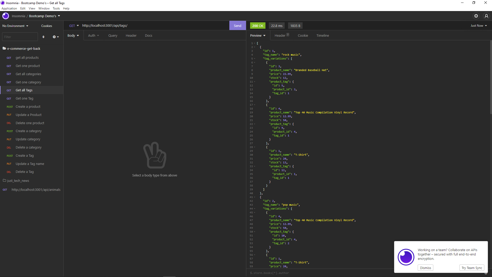

# e-commerce-get-back   

A bootcamp challenge to complete backend API endpoints for a fake e-commerce site using Node.js, Express.js, and Sequelize.

## Table of Contents
* [Description](#description)
* [Installation](#installation)
* [Usage](#usage)
* [License](#license)
* [References](#reference)
* [Contributing](#contributing)
* [Tests](#tests)
* [Questions](#questions)

## Description 
_***Built With:***_ JavaScript,ES6,Node,Express.js,MySQL  
This was a bootcamp challenge to build the back end for an e-commerce site. With a given Express.js API, I configured it to use Sequelize to interact with a MySQL database. It was actually very straight forward. I didn't encounter any major hurdles. I see the value in using Sequilize, because it can speed up and ease the process, allowing javaScript developers to work with SQL databases. Also, it eliminates errors. I didn't hate working with MySQL in last weeks project, though. So, I am also interested in continuing to gain skills interacting with it as well.

## Installation 
clone the repo to your local files. run npm i in the command line. 

## Usage 
run npm start in the command line. access the database using CRUD routes via Insommnia or some similar software.

[Demonstration Video](https://watch.screencastify.com/v/rHHQj3LQIHLTMagZgxHx)

## License 
[CC](./LICENSE)

## References 
None

## Contributing 
[Contributing Guidelines](./docs/contribute.txt)

## Tests 
N/A at this time

## Questions 
Contact: Sam Davenport  
https://github.com/steadysamwise4  
samueldavenport@att.net
    
